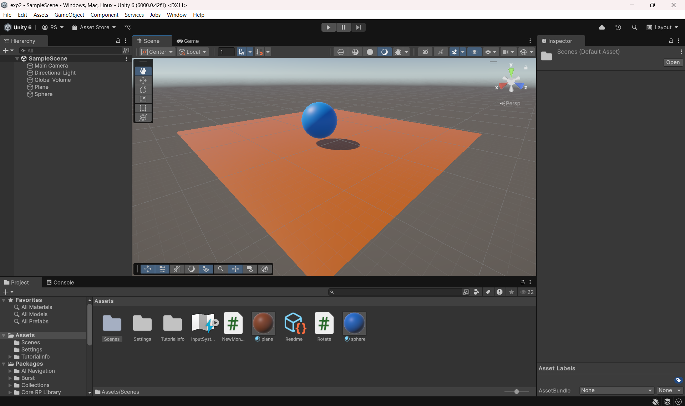

# Exp02-RollABall
## AIM :
 To Roll a Ball using C# program in unity .
## ALGORITHM 
## Step 1 :
Open Unity and create a New Project.

## Step 2 :
In the Hierarchy, right-click and select 3D Object > Plane, select 3D Object > Sphere (this will be your rolling ball).

## Step 3 :
Add a Rigidbody component to the ball:
Select Player in the Hierarchy and In the Inspector, click Add Component > Search for Rigidbody > Add it.

## Step 4 :
Assets -> Create -> # Script 

## Step 5 :
Create a folder name Coding and create a C# file to add the coding in it.

## Step 6 :
To attach the C# script to a selected object, click on the script file and drag it onto the desired object in the Hierarchy window, then run the application.

## Step 7 :
Play the Game – Control the ball using Arrow Keys or WASD.

## Step 8 :
Stop

## PROGRAM :

~~~c#
using System.Collections;
using System.Collections.Generic;
using UnityEngine;

public class NewMonoBehaviour : MonoBehaviour
{
    public float xForce = 5.0f;
    public float zForce = 5.0f;
    public float yForce = 100.0f;
    // Start is called before the first frame update
    void Start()
    {     
    }
    // Update is called once per frame
    void Update()
    {
        float x = 0.0f, y = 0.0f, z = 0.0f;
        if (Input.GetKey(KeyCode.A))
        {
            x = x - xForce;
        }
        if (Input.GetKey(KeyCode.D))
        {
            x = x + xForce;
        }
        if (Input.GetKey(KeyCode.W))
        {
            z = z - zForce;
        }
        if (Input.GetKey(KeyCode.X))
        {
            z = z + zForce;
        }
        if (Input.GetKeyDown(KeyCode.Space))
        {
            y = yForce;
        }
        GetComponent<Rigidbody>().AddForce(x,y,z);
    }
}
~~~

## OUTPUT :

## Result
Thus the experiment was successful. The ball moved as expected using Rigidbody physics and force-based movement.
